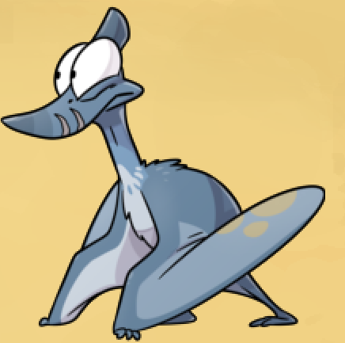

You completed work for the day, and Tra says her father wants to speak to you.

If you're curious about the backpack remains now in your inventory - ^[They're only used to get an optional pebble and can be dropped if you're not interested.]

# Where might he be?
The farm is a family business, so he likely lives nearby.

# Where is the farm house?
Right next to Tra - the cave entrance is a house, and her father is inside.

# Which one is Tra's father?
Like all bosses, he's lazing about and sleeping on the far side of the house.

## What does he have to say for himself?
You've had a quick talk, and these were his responses:

"Why were you up all night?" ^[The chief wanted everyone to gather more special mushrooms than usual, but nobody is sure why.]
"What else are you doing at the farm?" ^[Collecting and identifying various stones - he wants to know if you found any heavy rocks, and if you have, you get a pebble.]
"Is there any other job to do around here?" ^[He can't think of anything right now, but encourages you to ask Tra if you want more paid work.]

## What else did he have to say?
"Who is that girl over there?" ^[His other, less loved daughter. She's supposed to be making pillows, but is too stubborn to take a thinner thread for her needle.]

# What can I do now?
You have a few options:
1) Helping to water the plants
2) Reporting your stolen money
3) Returning to the town and talking to someone that you couldn't find earlier.

# Tell me about the extra work.
Talk to Tra to sign up for the [extra task.](Money/watering.md) You should do this at least once.

^[The item that this little job gives you is used later.]

# Tell me about reporting my stolen money.
You may have done it earlier, but northeast of the plaza there is a guard that you can report your missing money to.

## What did he have to say?
The Triceratops guards a large entrance (and an equally large food bowl.)

"Help, I've been robbed!" ^[He said he would notify the security team, and that's about it.]
"You mentioned you're a librarian...?" ^[The library is large, and his horns made for great basket carriers! He misses that job.]

## Did he have anything else to say?
"What's behind that gate you're guarding?" ^[The entrance to the Residential Wall, a place with the Chief's apartment on the top floor. Non-residents are not allowed in.]
"I guess you don't like your job that much?" ^[He hates it, and really misses his books - but needs to support his family somehow.]

# Tell me about the new dinosaur I can talk to.
Did you happen to find a house with a Navajodactylus inside? This new dinosaur was mentioned by that Navajodactylus.

If you don't know what a Navajodactylus is / looks like, see this image. ^[]

## Who am I looking for, and where are they?
The healer's house in the west district now has the titular healer in it - go introduce yourself!

## What does she have to say?
"Nice place you got here." ^[Thanks! She uses a lot of herbs for a lot of things, including cures for the common cold.]
"Have you been in this business for long?" ^[Since she was a hatchling - her father taught her a lot, but the village's pharmacy owner knows the most.]

## Does she have anything else to say?
(After asking about the Navajodactylus' injuries) ^[She found him while on a hike, and her precious family heirloom was stolen while she was helping him.]
"There's a pharmacy in the village?" ^[Yes, but it can only be visited by those with a special pass.]
"A theft?!" ^[Her precious decorative skull was stolen, and the chief isn't too concerned.]

# What now?
You have a few leads to follow:
[Curing a shop owner's cold](cold.md)
[Getting a special pharmacy pass](Pharmacy/specialpass.md)
[Finding something soft](soft.md)