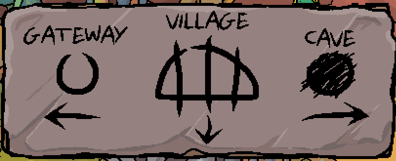

After a bit of exploring, you may have found some symbols telling you (roughly) where to go.

If you'd like to see them again, click the question mark. ^[]

# Where should I begin looking for the village?
As the symbols showed, you should be looking to the south after heading west of the Undercave entrance.

# I've gone south - where to now?
This path is a bit awkward to navigate - keep trying to go west and you'll eventually make it to the village.

# What can I do in the village?
You should have a look around - the village is surprisingly big, and there are plenty of paths to explore!

# Where should I start?
Why not try to find some villagers to talk to?

# Where might they hang out?
Well, shady spots are nice to hang out in. Head into the cool shade street on the right!

## Now what?
Aw, crap! All that money gone in an instant! Maybe that friendly dinosaur Tra could help you? If only you [knew where she was...](tra.md)

Generally speaking though, the village is now totally open for you to explore. Look around, talk to everyone you see, and get immersed in this adorable dinosaur settlement!