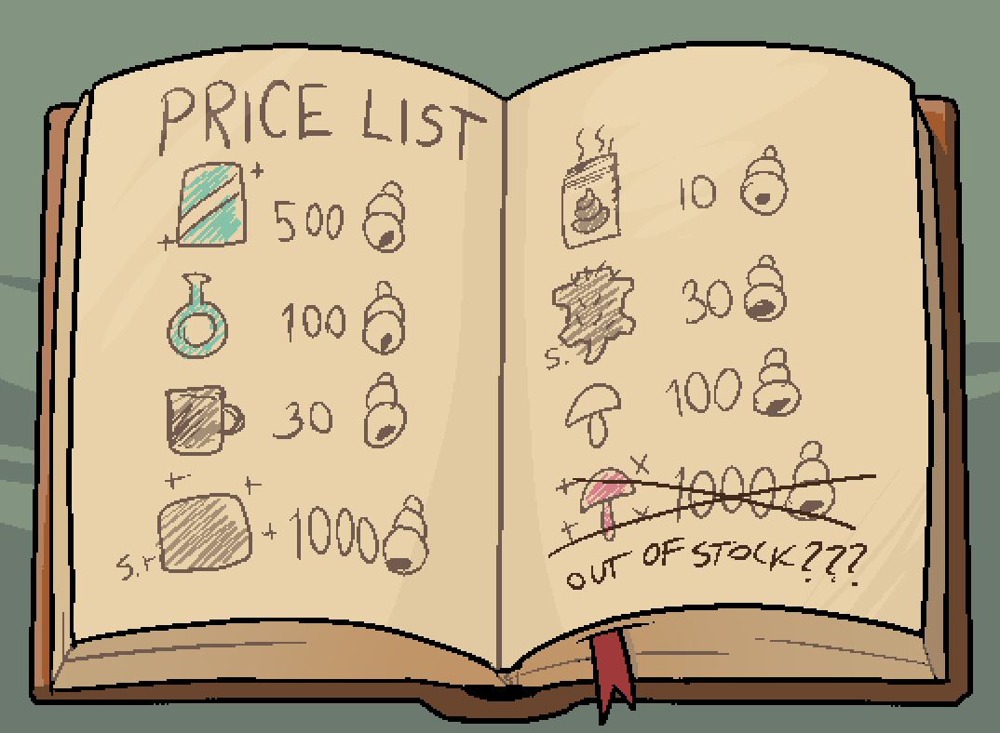
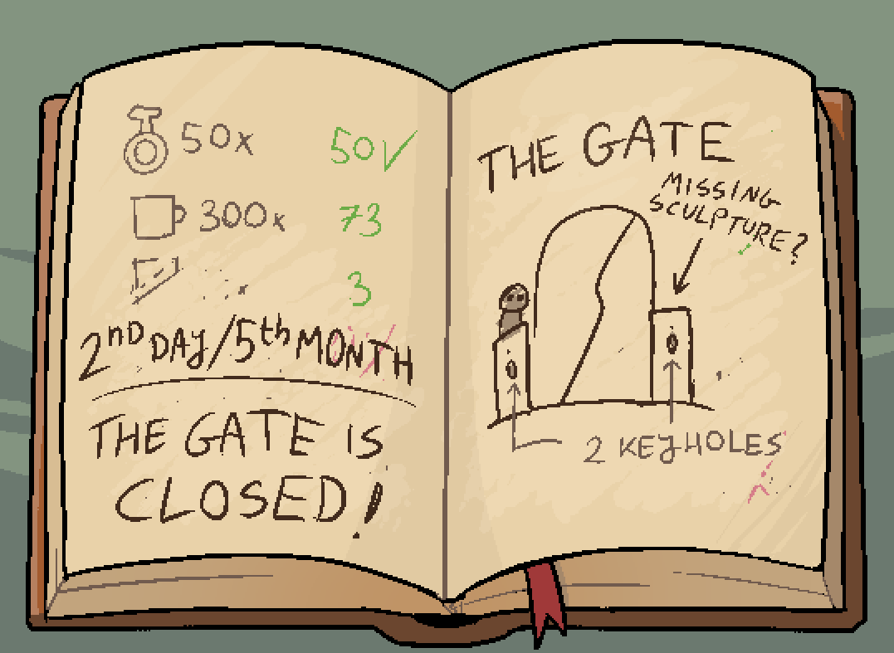
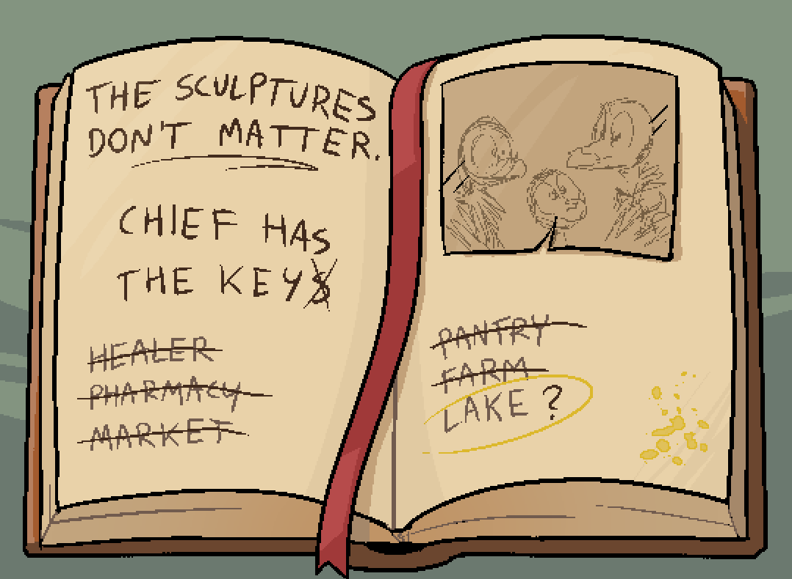

Secret tunnel found! What do we have here, and what do we use it for?

# What should I be taking from here?
In non-spoilery terms, you'll find:
1) A family heirloom
2) A book

# Where do I find the family heirloom?
There isn't much to see in the tunnel - have a good look around.

# I only see bags.
Have you tried taking something from them?

## Zniw doesn't seem interested.
Select the 'Investigate wares' option from the context menu.

# Where do I find the book?
It's clearly visible on a pedestal on the left.

## What's all this stuff inside?
The first section seems to have price information. ^[]
The second section seems to have some additional price information, and mentions the gate. ^[]
The third section seems to have eyebrow-raising information. ^[]

After acquiring everything, Zniw leaves the cloak behind.

# So what do I do with this skull?
Do you remember anyone who had a decorative skull like this?

# Hmm...
They were helping someone who crashed near their village when it was stolen.

## Who does this skull belong to?
The healer! Return to her house and give it to her.

# What was my reward?
A slab of clay that gets you a discount at the used wares shop on the east side of town! Nice!

# How good is the discount?
It's a whopping 50% off all items!