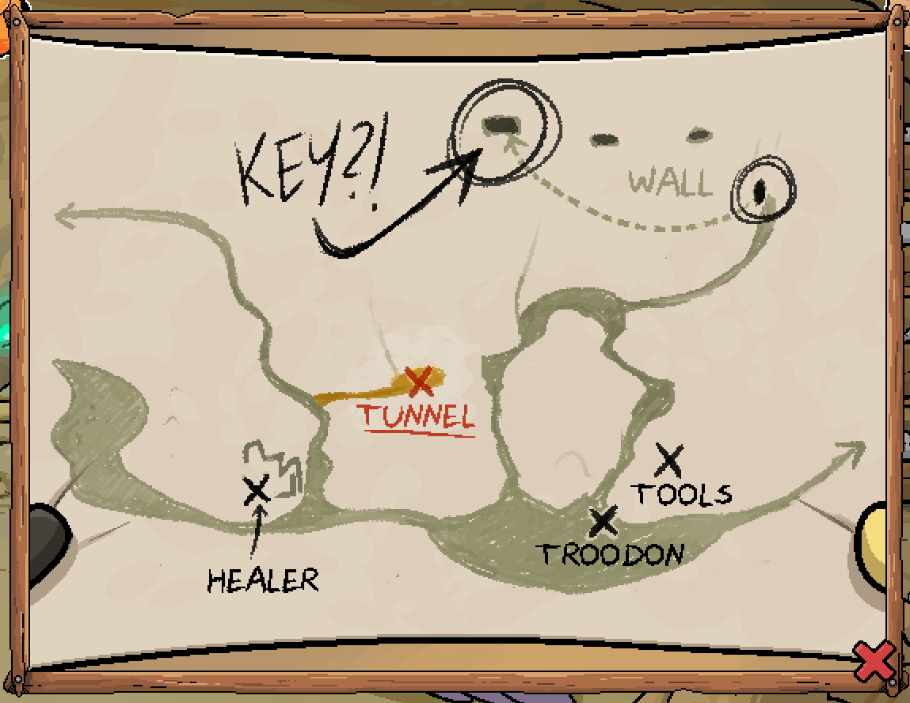

The map pointed out a hidden tunnel somewhere in the village. Maybe the thief hid something there?

# Can I see the map again?
Sure! You know the drill - click the question mark. You can also access the map from your inventory by reading it via the cloak.

^[]

# What am I looking for?
It seems to be in the western district, above the healer's house.

# Can I get another hint?
It seems to be above some kind of 'lump' in the path.

# There doesn't seem to be an entrance here...
If you were a sneaky thief, wouldn't you try to obscure the entrance somehow?

## Can you tell me where the secret tunnel is?
Move through the blue plants north-east of the healer's house. Finding spots to move through is tricky, but keep moving your mouse and clicking when it turns green to find the way.

# Slight problem - there is no tunnel here!
Yes, it seems like the path is blocked. Maybe [someone could help you to clear it?](trash.md)