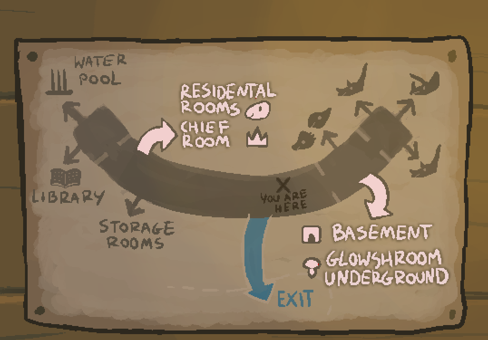
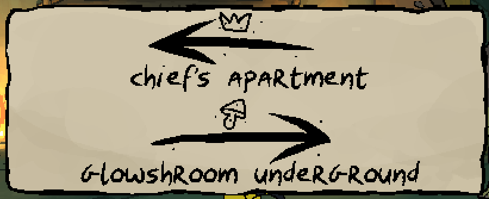

Now that we're in an otherwise restricted zone, what can we find?

# That's what I'm on this guide to find out!
Fair enough. The bulletin board that you saw when you arrived at the top of the stairs had some useful information.

## What was on the bulletin board?
In no particular order:

1) A map of the area, that you can see a picture of by clicking the question mark. ^[]
2) An 'employee of the month' notice, congratulating Eizo the Spinops.
3) Glowshroom gathering procedures
4) Directions, that you can see a picture of by clicking the question mark. ^[]
5) A wanted poster, triumphantly marked 'CAPTURED'.
6) Scribblings - 'GARY WAS HERE'.

# What else can I find in this area?
A chasmosaurus blocks the path to the east, and going west takes you to a long corridor.

## And what can I find in this corridor?
1) To the south, an entrance to the storage rooms.
2) To the north, stairs leading up to some residential rooms.
3) A young Albertadromeus, just hanging out.

## What can I find in the area with residential rooms?
One regular wooden door that can be opened, and one solid wooden door that cannot. 

# What now?
Locked doors are pretty enticing, right? Maybe you should try to [unlock it?](felony.md)