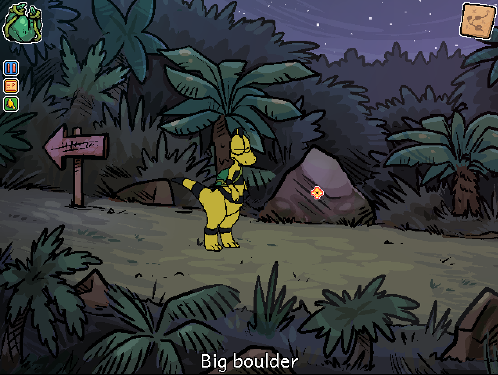

Errand completed, directions received - it's time to get out of this forest!

# What were her directions?
She told you that a hidden path was behind a boulder next to the signpost - it's hard to spot due to all the shrubs and bushes, but searching will reveal it with ease.

# Can you show me the boulder?
Certainly! Click the question mark to see a picture. ^[ ]

# I see it - how do I travel past it?
In the interaction menu, release your mouse over the magnifying glass icon.

## What do I do with this red fruit?
Eat it! There's no real gameplay / puzzle significance to it, and some items are just edible like this.

## And the cycas cone?
You can't eat it or really do anything with it - in fact, travelling down the secret path will remove it from your inventory anyway.

It was added to your encyclopedia, though, so if you're curious about the flora of the prehistoric era then you can read all about it!